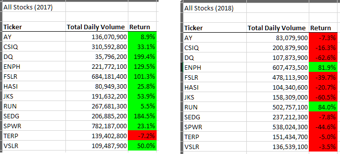
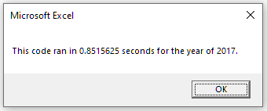
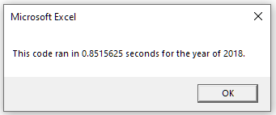
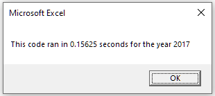
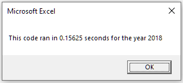

# VBA of Wall Street
## Overview of Project: 
To help Steve recommend stocks for his parents, twelve stocks in the green energy sector were analysized with regards to their yearly trading volumes and returns for the years of 2017 and 2018. Additionally, it is found that his parents' original choice of stock (ticker: DQ) had good returns for the year of 2017, but not for 2018.
## Results: 

The Total Daily Volumes and Returns of twelve stocks in the green energy sector were summarized in the following figure. It is evident that the number of stocks with negative returns has increased from 1 to 10 out of total 12 stocks. It may suggest that the green energy sector in general has performance issues probably due to reduced government fundings. However, performance of two stocks (tickers: ENPH and RUN) maintained their positive performance for both 2017 and 2018. Especially for RUN, the annual return increased from 5.5% to 84.0% from 2017 to 2018.

 

Additionally, VBA codes were used to quickly analyze the stocks data. Two versions of VBA codes were developed and their performance is compared as following.

As shown in the above figures, it takes 0.85 second to analyse the stocks data using the original script. The origianl VBA script was refactored in order to reduce the run time. As shown below, the run time is reduced to 0.16 second.

Therefore, the analysis speed is increased by more than 5 times, making it less costly to analyze much more stocks.

## Summary: 

### Advantages or disadvantages of refactoring code 
 
The advantage of refactoring code is that the functionality of the original codes can be easily adopted. For example, syntaxes and outcomes are correct, which provides a good starting point for new coders.
 
 
The disadvantage is that the coder may not fully understand the scripts so he/she can be prone to causing errors if scripts are mistakenly modified. Another disadvantage is that refactoring code does not create new functionalities.
 

### How do these pros and cons apply to refactoring the original VBA script?
 
The original VBA script is already able to perform the correct analysis, thereby providing a good starting point for refactoring. 
 
 
However, new functionality is needed to reduce the run time because the original script searches the entire data table multiple times, each time looking for only one stock. Therefore, the run time is proportional to the number of stocks, which is costly to run when analyzing many more stocks. To avoid this disadvantage, new functionality is needed to take advantage of the structure of the data table, so that the refactored script searches the data table for only once, thereby reducing the run time significantly. For example, when the last trading day of one stock is detected, the ticker index is increased by one, getting ready to collect information for the next stock.
